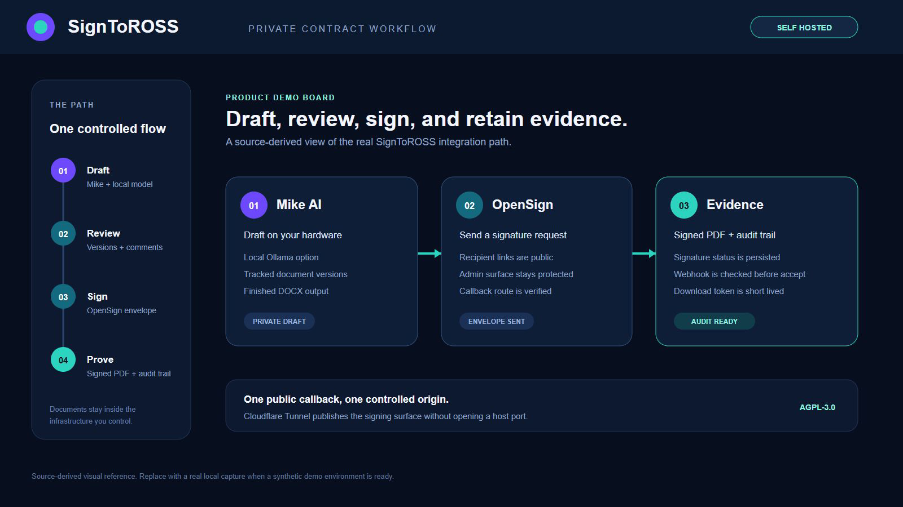
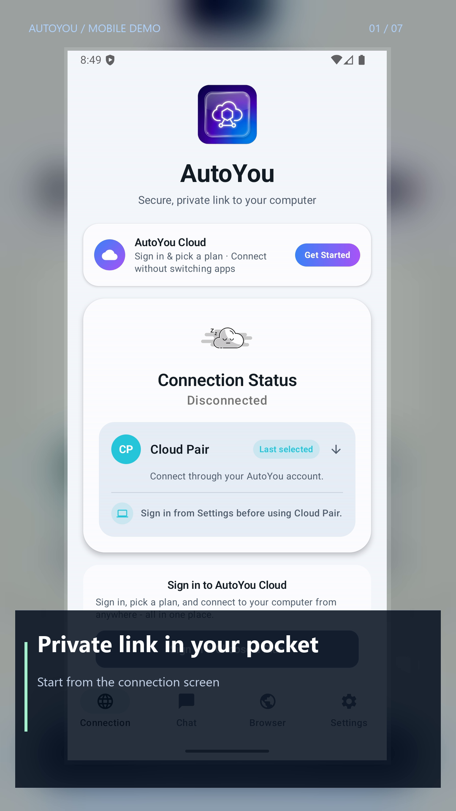

# SignToROSS

Draft a contract, send it for signature, and collect the signed PDF — on your
own hardware, on your own hostname, with the documents never leaving
infrastructure you control.

SignToROSS wires together two open-source projects and the plumbing that makes
them usable from outside your network:

- **[OpenSign](https://github.com/OpenSignLabs/OpenSign)** — the e-signature
  service. Self-hosted DocuSign: templates, recipients, signing order, audit
  trail, signed PDFs.
- **[Mike](https://mikeoss.com)** *(optional)* — an AI legal document
  assistant. Drafts and revises documents, runs tabular review across a
  document set, and hands a finished DOCX to OpenSign for signature. Works
  against a local Ollama model, so drafts need not leave the machine either.
- **A Cloudflare Tunnel agent** — publishes the stack on your hostname without
  opening a port, and tells you when the published surface is misconfigured.

Signature requests need a public callback URL, which is the part that usually
stops a self-hosted deployment. That is what the tunnel agent is for.

## Demo assets





The [`screenshots/`](screenshots) folder contains the editable workflow board,
a rendered README image, a portrait-first AutoYou mobile walkthrough, short
reference reels, and safe capture scripts. The workflow board and mobile reel
are product references. They do not represent a live signing transaction.

- [Reference video reel](screenshots/signtoross-demo-reference.mp4)
- [Live-site reference reel](screenshots/test-autoyou-reference.mp4)
- [Portrait mobile companion demo](screenshots/autoyou-mobile-demo-vertical.mp4)
- [Portrait live-site reference](screenshots/test-autoyou-vertical-reference.mp4)
- [Capture script](screenshots/demo-script.md)
- [Portrait demo notes](screenshots/mobile-demo-script.md)
- [AutoYou live surface reference](https://test.autoyou.me/)

## Is this for you?

Good fit if you want signature workflows on infrastructure you control — a firm
that cannot send client documents to a third-party SaaS, a company with
retention rules, anyone who would rather not pay per envelope.

Not a fit if you want zero operations. You are running Docker, a database and a
DNS record, and you are the one on call for them.

**This is not legal advice, and it is not a compliance product.** Whether an
electronic signature is enforceable for your document, in your jurisdiction,
between your parties, is a question for a lawyer. The software produces
signatures and an audit trail; it does not tell you they are sufficient.

## What you need

| | |
|---|---|
| Docker | Docker Desktop, or Engine + Compose v2 |
| Node.js 20+ and npm | only for Mike; skip if you want OpenSign alone |
| A domain on Cloudflare | for the public signing hostname |
| `cloudflared` | [install guide](https://developers.cloudflare.com/cloudflare-one/connections/connect-networks/downloads/) |
| Python 3.10+ | for the tunnel agent; no packages to install |
| Supabase project | Mike only — auth and Postgres. A local Supabase works |
| S3-compatible storage | Mike only — Cloudflare R2, Supabase Storage, or MinIO |
| Ollama | optional, for drafting with a local model |
| LibreOffice | optional, for DOCX to PDF conversion |

## Quick start

### 1. Signing service

```bash
git clone https://github.com/autoyou-ai/signtoross.git
cd signtoross
cp services/opensign/.env.example services/opensign/.env
cp services/opensign/.env.prod.example services/opensign/.env.prod
```

For a fresh installation, edit `services/opensign/.env.prod` and set a random
Parse master key, your SMTP settings, and a document-signing certificate and
passphrase. See [OpenSign's configuration guide](https://docs.opensignlabs.com/docs/self-host/docker/run-locally/)
for those settings. SMTP credentials do not create an administrator account.
Keep existing deployment files and database volumes when upgrading.

`services/opensign/.env` sets `HOST_URL`, initially `http://127.0.0.1:3051` for
local setup. Compose uses it for both the browser and server URLs. Then:

```bash
docker compose --env-file services/opensign/.env -f services/opensign/docker-compose.yml up -d
```

Open `http://127.0.0.1:3051` and complete OpenSign's initial administrator wizard
on a fresh database. Sign in and confirm the dashboard loads. The wizard is
described in [OpenSign's account setup guidance](https://docs.opensignlabs.com/docs/self-host/guides/upgrade-to-v2.1.0/).

The browser calls `/api/app`; Caddy strips `/api` and forwards to the server's
`PARSE_MOUNT=/app`. Keep that mount unchanged. To validate the example
configuration without reading or replacing your live environment files:

```powershell
.\scripts\verify-signtoross.ps1 -SkipBuild
```

> Keep the stack on loopback. Publishing it is the tunnel's job, and binding it
> to a LAN address is what causes the routing fault described below.

### 2. Public hostname

After local setup, set `HOST_URL=https://sign.example.com` in
`services/opensign/.env`, using your actual signing hostname without a trailing
slash. Re-run the same Compose command to update both server and browser URLs.
Local-only invitation links cannot be used by recipients on other machines.
Configure the public hostname before testing a complete signing request.
OpenSign also fetches the completed PDF from inside its server container when
attaching it to email. That container cannot reach the host's Caddy listener
at `127.0.0.1:3051`; use a signing hostname reachable by both it and recipients.
The loopback default above is for initial administrator setup.

Create a Cloudflare Tunnel in the [Zero Trust
dashboard](https://one.dash.cloudflare.com/) → Networks → Tunnels. Add a public
hostname for your signing domain and point it at `http://127.0.0.1:3051`. Copy
the tunnel token into `.local/cloudflared-token.txt` — that path is gitignored,
and the token must never be committed or passed as a command argument.

```bash
python tools/tunnel-agent/signtoross_tunnel.py preflight
python tools/tunnel-agent/signtoross_tunnel.py up --hostname sign.example.com
```

`preflight` checks cloudflared, the token, the origin and the route before
anything starts. `up` starts exactly one connector and verifies the hostname
serves.

### 3. Check what you just published

```bash
python tools/tunnel-agent/signtoross_tunnel.py harden --hostname sign.example.com
```

This looks at your hostname from outside: traffic really arriving through
Cloudflare, HSTS and `nosniff` and a referrer policy in place, the signing page
not framable, and `/health` and `/api/app` not publicly reachable. The bundled
Caddyfile sets every header it checks, so a failure here means the edge is
running an older config — restart it and re-run.

Two things it reports but cannot verify from one client, both worth doing in
the Cloudflare dashboard:

- **Rate limiting** on the signing and login paths.
- **Cloudflare Access** in front of the admin surface, so only your identity
  provider reaches it while the signing pages recipients need stay public.

Take the hostname down when you are not sending signatures:

```bash
python tools/tunnel-agent/signtoross_tunnel.py down
```

### 4. Document assistant (optional)

Skip this if OpenSign alone is what you wanted.

```bash
cp apps/mike/backend/.env.example  apps/mike/backend/.env
cp apps/mike/frontend/.env.local.example apps/mike/frontend/.env.local
npm install --prefix apps/mike/backend
npm install --prefix apps/mike/frontend
```

Fill in Supabase, storage, a model provider, and the OpenSign settings below.
Apply the schema in `apps/mike/backend/schema.sql` to a fresh database. On
Windows, `.\scripts\install-mike.ps1` does the dependency install for you.

```bash
npm run dev --prefix apps/mike/backend    # http://127.0.0.1:3001
npm run dev --prefix apps/mike/frontend   # http://localhost:3000
```

For local drafting, pull the model named by `OLLAMA_MODEL` and set
`AI_PROVIDER=ollama` or `OLLAMA_ENABLED=true`.

## Connecting Mike to OpenSign

Point Mike at the OpenSign instance you started in step 1:

```env
SIGNING_PROVIDER=opensign
OPENSIGN_API_MODE=selfhost
OPENSIGN_PARSE_BASE_URL=http://127.0.0.1:3051/api/app
OPENSIGN_PUBLIC_URL=https://sign.example.com
OPENSIGN_PARSE_HOST_HEADER=sign.example.com
OPENSIGN_PARSE_APP_ID=opensign
OPENSIGN_PARSE_MASTER_KEY=the-master-key-you-set-in-step-1
OPENSIGN_ADMIN_EMAIL=admin@example.com
OPENSIGN_ADMIN_PASSWORD=the-admin-password-you-set-in-step-1
OPENSIGN_WEBHOOK_SECRET=a-secret-you-generate
```

Or, against OpenSign's hosted API instead of your own:

```env
OPENSIGN_API_MODE=token
OPENSIGN_API_BASE_URL=https://sign.example.com/api/v1.2
OPENSIGN_API_TOKEN=your-opensign-x-api-token
```

Configure OpenSign to call Mike back at:

```text
<MIKE_PUBLIC_API_BASE_URL>/webhooks/signing/opensign
```

with the same `OPENSIGN_WEBHOOK_SECRET`. Set `PUBLIC_WEBHOOK_REQUIRED=true` and
Mike rejects unsigned callbacks.

Mike's health endpoints stay private by design — the public route does not
expose them. Check them on loopback:

```text
http://127.0.0.1:3001/health
http://127.0.0.1:3001/health/integrations
```

## When the hostname misbehaves

If it serves some requests and returns 502 on others, **do not restart the
tunnel** — restarting starts another connector and makes it worse. Run:

```bash
python tools/tunnel-agent/signtoross_tunnel.py doctor --hostname sign.example.com
```

A tunnel's routes belong to the tunnel, not to a connector, so every connector
holding the token receives all of them and Cloudflare balances across them. Two
connectors resolve `127.0.0.1` to two different machines: one reaches your
OpenSign, the other cannot, and you get a hostname that is up and down at the
same time. `doctor` samples the hostname and names that signature directly;
`status` lists the connectors, including a Windows service or container you may
have forgotten. The fix is always to get back to one connector on the host that
owns the origin.

## Verify

```powershell
.\scripts\verify-public-tree.ps1          # no secrets, machine paths, or licence drift
.\scripts\verify-signtoross.ps1 -SkipBuild
```

More integration checks are documented in `apps/mike/README.md`.

## Keeping secrets out

Real `.env`, `.env.prod`, `.env.local`, tunnel tokens and admin credentials are
gitignored and must never be committed, along with SMTP passwords, Parse master
keys, Supabase service-role keys and DNS-provider tokens.
`scripts/verify-public-tree.ps1` checks for all of these plus machine-local
paths and nested git metadata. Run it before you push a fork.

## Layout

```text
apps/mike/           Document assistant: Next.js frontend, Node backend, schema
services/opensign/   OpenSign Compose template and hardened Caddy edge
tools/tunnel-agent/  Cloudflare Tunnel CLI, with Claude and OpenAI manifests
scripts/             Windows install, startup and verification helpers
```

## Driving it from an assistant

`tools/tunnel-agent/manifests/` ships a Claude skill and an OpenAI
function-calling schema covering all six tunnel commands, so an assistant can
bring the hostname up, check it, diagnose it and take it down. Every command
supports `--json` and returns a remedy string with each failed check. See
[`tools/tunnel-agent/README.md`](tools/tunnel-agent/README.md).

## License

AGPL-3.0. See [`LICENSE`](LICENSE) and [`NOTICE`](NOTICE) for attribution.

`apps/mike` derives from [Mike](https://mikeoss.com) and `services/opensign`
runs [OpenSign](https://github.com/OpenSignLabs/OpenSign), both AGPL-3.0, so the
whole repository carries the same licence rather than leaving any part of it
ambiguous.

**If you deploy this, section 13 applies to you.** Running a modified version
and letting people interact with it over a network obliges you to offer those
users the source of your modified version. That is the ordinary case for this
software, not an edge case. Publish your fork and keep a link to it reachable
from the running service.
