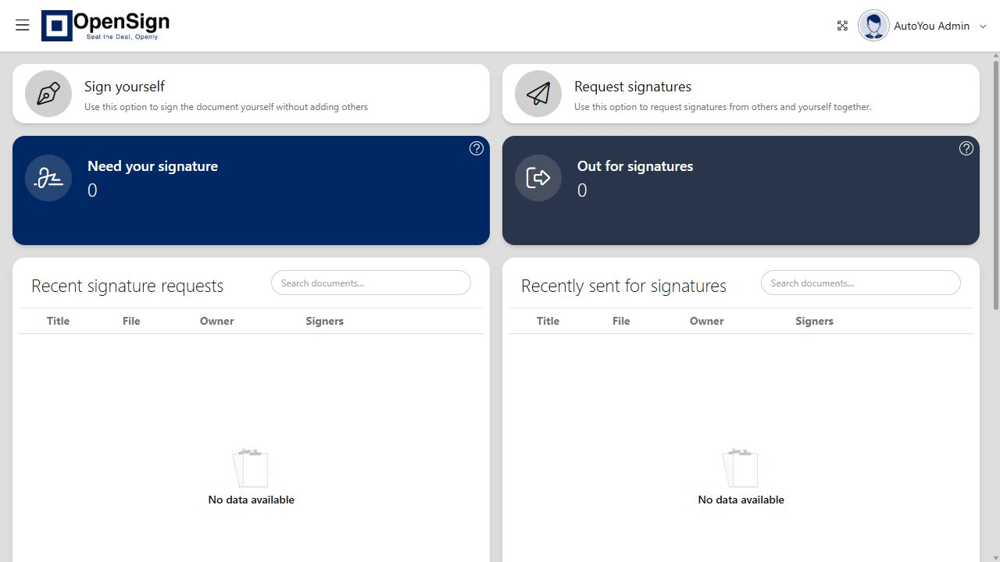

# SignToROSS

Self-host document drafting and electronic signatures with [Mike](https://mikeoss.com),
[OpenSign](https://github.com/OpenSignLabs/OpenSign), and an optional local Ollama model.
Mike prepares documents; OpenSign manages recipients, signing, and the signed PDF.

| Start here | What you need |
| --- | --- |
| [Run OpenSign](docs/self-hosting.md#1-signing-service) | Docker and Compose v2 |
| [Add a public signing hostname](docs/self-hosting.md#2-public-hostname) | Your domain and Cloudflare Tunnel |
| [Add Mike](apps/mike/README.md) | Node.js 20+, Supabase, S3-compatible storage, and a model provider |
| [Contribute](CONTRIBUTING.md) | A focused change and the checks below |

## Hosted OpenSign

The capture below is the actual dashboard at [sign.autoyou.me](https://sign.autoyou.me/).
It shows an empty document workspace. The hosted instance requires an account;
cloning this repository does not grant access to it.



[Capture details](screenshots/README.md) record the source and what each image verifies.

## Run your own signing service

```bash
git clone https://github.com/autoyou-ai/signtoross.git
cd signtoross
cp services/opensign/.env.example services/opensign/.env
cp services/opensign/.env.prod.example services/opensign/.env.prod
```

Set a unique Parse master key, SMTP settings, and your signing certificate in
`services/opensign/.env.prod`. Keep real environment files private. Then start:

```bash
docker compose --env-file services/opensign/.env -f services/opensign/docker-compose.yml up -d
```

Open `http://127.0.0.1:3051` and complete the administrator setup on a fresh
database. Before inviting recipients, set `HOST_URL` in `services/opensign/.env`
to your public HTTPS signing hostname, configure its tunnel, and rerun Compose.
Keep existing environment files and database volumes when upgrading.

The [self-hosting guide](docs/self-hosting.md) covers the public URL, SMTP,
Mike connection, signed webhooks, and tunnel troubleshooting.

## Mike and local Ollama

Follow [Mike's setup guide](apps/mike/README.md) for its database, storage, and
frontend configuration. For local inference, configure Mike's backend:

```env
AI_PROVIDER=ollama
OLLAMA_ENABLED=true
OLLAMA_API_BASE=http://127.0.0.1:11434
OLLAMA_MODEL=ministral-3:8b
OLLAMA_CLOUD_FALLBACK=false
```

Install the selected model in Ollama first, then select the local model in Mike.
Mike's drafting adapter calls this Ollama endpoint directly. To share AutoYou's
Ollama runtime, use the same endpoint and model that AutoYou uses.

The optional AutoYou HTTP bridge also checks runtime readiness and requests a
workflow-advice response through AutoYou's `/api/chat` endpoint:

```env
AUTOYOU_ADMIN_API_BASE=http://127.0.0.1:8001
AUTOYOU_CHAT_API_BASE=http://127.0.0.1:8081
AUTOYOU_RUNTIME_REQUIRED=true
AUTOYOU_SIGNTOROSS_ADVICE_REQUIRED=true
```

Those bridge checks run in the integration doctor. They do not change Mike's
normal drafting route. Keep admin, model, and diagnostic ports private.
The [live integration guide](apps/mike/docs/opensign-ollama-live-loop.md) explains
how to verify the model response and OpenSign handoff on your deployment.

## Verify and contribute

From the repository root in PowerShell:

```powershell
.\scripts\verify-public-tree.ps1
.\scripts\verify-signtoross.ps1 -SkipBuild
```

After changing Mike code, install dependencies and run the builds and relevant
integration checks in [CONTRIBUTING.md](CONTRIBUTING.md). Mock integration tests
verify contracts; use the live preflight separately to check a real deployment.

| Directory | Purpose |
| --- | --- |
| `apps/mike/` | Mike frontend, backend, document tools, and signing adapters |
| `services/opensign/` | OpenSign Compose and Caddy configuration templates |
| `tools/tunnel-agent/` | Cloudflare Tunnel preflight and diagnostics |
| `scripts/` | Installation, startup, and verification helpers |
| `screenshots/` | Captures of the actual signing and drafting applications |

## License

[AGPL-3.0](LICENSE). Mike derives from MikeOSS, and OpenSign is a separate upstream
project. Preserve their notices and offer the corresponding modified source when
required by the license. See [NOTICE](NOTICE).

The software assists with documents and signing; it does not establish that a
document is legally sufficient or that a deployment meets a particular regulation.
